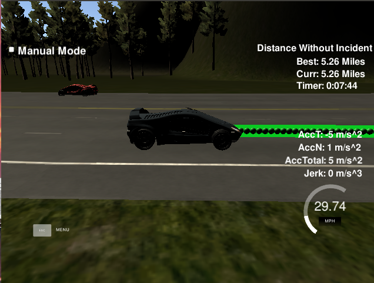

# CarND-Path-Planning-Project
Self-Driving Car Engineer Nanodegree Program
   
### Simulator.
You can download the Term3 Simulator which contains the Path Planning Project from the [releases tab (https://github.com/udacity/self-driving-car-sim/releases/tag/T3_v1.2).

### Goals
In this project your goal is to safely navigate around a virtual highway with other traffic that is driving +-10 MPH of the 50 MPH speed limit. You will be provided the car's localization and sensor fusion data, there is also a sparse map list of waypoints around the highway. The car should try to go as close as possible to the 50 MPH speed limit, which means passing slower traffic when possible, note that other cars will try to change lanes too. The car should avoid hitting other cars at all cost as well as driving inside of the marked road lanes at all times, unless going from one lane to another. The car should be able to make one complete loop around the 6946m highway. Since the car is trying to go 50 MPH, it should take a little over 5 minutes to complete 1 loop. Also the car should not experience total acceleration over 10 m/s^2 and jerk that is greater than 10 m/s^3.

## Project Instructions and Rubric

Note: regardless of the changes you make, your project must be buildable using
cmake and make!

### The code compiles correctly.

1. Clone this repo.
2. Make a build directory: `mkdir build && cd build`
3. Compile: `cmake .. && make`
4. Run it: `./path_planning`.

### The car is able to drive at least 4.32 miles without incident..

I ran the simulator for 5 miles without incidents:

### The car drives according to the speed limit.
No speed limit red message was seen.

### Max Acceleration and Jerk are not Exceeded.
Max jerk red message was not seen.

### Car does not have collisions.
No collisions.

### The car stays in its lane, except for the time between changing lanes.
The car stays in its lane most of the time.

## Reflection

### There is a reflection on how to generate paths.

I use 4 steps to generate and determine the best trajectory.

First, I use sensor information and vehicle localization to check if it has car in front of us or beside of us. Every 20 ms the SDC vehicle receives sensor fusion data from the simulator as an array of [id, x, y, vx, vy, s, d] elements for every tracked vehicle, where id is unique ID of vehicle, (x,y) is position and (vx, vy) is vector speed of tracked vehicle, (s, d) is position in Frenet coordinates. I use d to check if the obstacle is in out lane or beside our lane; I use s to determine if the obstacle is risk to our car. (main.cpp  line 281 - line 310)

Second, the drive policy is determined by previous step result. If it has car in front of us and its speed it slow than us, then we decide to change lane to left/right lane. If we decide to change lane and the target lane has car in the lane and the s distance between our car and the target lane car is less than the safe distance, then we pause the change lane action until the target lane is clean or the s distance become larger than safe distance. (main.cpp  line 313 - line 332)

Third, I set the motion plan target to generate trajectory. Motion Planning is implemented in the FRENET´ FRAME. I set the target s to 30/60/90 , and target d to 2 + 4*lane. The lane value is determined by the second step. (main.cpp  line 334 - line 338)

Last, I use spline to generate feasible trajectory. In order to ensure more continuity on the trajectory, the pass trajectory points are copied to the new trajectory. The rest of the points are calculated by evaluating the spline and transforming the output coordinates to not local coordinates. (main.cpp line 248 - line 280, line 338 - line 388)